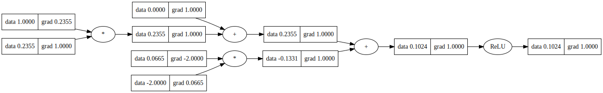

# 🧠 micrograd

<div align="center">


*A tiny Autograd engine with a bite! 🐕*


</div>

## 📖 About

**micrograd** is a minimal implementation of an automatic differentiation engine that implements backpropagation (reverse-mode autodiff) over a dynamically built DAG. It includes a small neural networks library with a PyTorch-like API, perfect for educational purposes and understanding the fundamentals of deep learning.

### ✨ Key Features

- 🔄 **Automatic Differentiation**: Implements reverse-mode autodiff over dynamically built computation graphs
- 🧮 **Scalar Operations**: Operates on individual scalar values for maximum clarity
- 🏗️ **Neural Network Library**: Built-in neural network components (Neuron, Layer, MLP)
- 📊 **Visualization Support**: Graphviz integration for computation graph visualization
- 🎯 **Educational Focus**: Clean, readable code perfect for learning autograd concepts

## 🚀 Installation

```bash
pip install micrograd
```

## 💡 Quick Start

### Basic Usage Example

```python
from micrograd.engine import Value

# Create scalar values
a = Value(-4.0)
b = Value(2.0)

# Build computation graph
c = a + b
d = a * b + b**3
c += c + 1
c += 1 + c + (-a)
d += d * 2 + (b + a).relu()
d += 3 * d + (b - a).relu()
e = c - d
f = e**2
g = f / 2.0
g += 10.0 / f

# Forward pass
print(f'{g.data:.4f}')  # prints 24.7041

# Backward pass (automatic differentiation)
g.backward()
print(f'{a.grad:.4f}')  # prints 138.8338 (dg/da)
print(f'{b.grad:.4f}')  # prints 645.5773 (dg/db)
```

### Neural Network Training

The project includes a complete demo of training a 2-layer neural network for binary classification:

```python
from micrograd.nn import MLP

# Create a 2-layer MLP
model = MLP(2, [16, 16, 1])  # 2 inputs, 2 hidden layers of 16 neurons, 1 output

# Training loop (see demo.ipynb for complete example)
for epoch in range(100):
    # Forward pass
    y_pred = model(x)
    loss = svm_loss(y_pred, y_true)
    
    # Backward pass
    model.zero_grad()
    loss.backward()
    
    # Update parameters
    for p in model.parameters():
        p.data -= learning_rate * p.grad
```

## 📊 Demo Results

The included demo trains a neural network on the moon dataset, achieving the following decision boundary:


## 🔍 Graph Visualization

Visualize computation graphs using the included Graphviz integration:

```python
from micrograd import nn
from micrograd.engine import draw_dot

n = nn.Neuron(2)
x = [Value(1.0), Value(-2.0)]
y = n(x)
dot = draw_dot(y)
```



## 🧪 Testing

Run the test suite to verify gradient calculations against PyTorch:

```bash
# Install PyTorch for reference testing
pip install torch

# Run tests
python -m pytest
```

## 📁 Project Structure

```
micrograd/
├── 📁 micrograd/
│   ├── 🐍 engine.py      # Core autograd engine
│   ├── 🧠 nn.py          # Neural network components
│   └── 📄 __init__.py
├── 📁 test/
│   └── 🧪 test_engine.py # Unit tests
├── 📓 demo.ipynb         # Training demo
├── 📊 trace_graph.ipynb  # Visualization demo
└── 📄 setup.py
```

## 🎯 Use Cases

- 📚 **Educational**: Learn how autograd engines work under the hood
- 🔬 **Research**: Prototype new gradient-based algorithms
- 🎓 **Teaching**: Demonstrate neural network fundamentals
- 🧪 **Experimentation**: Test custom loss functions and architectures

## 🤝 Contributing

Contributions are welcome! Feel free to:

- 🐛 Report bugs
- 💡 Suggest new features
- 📝 Improve documentation
- 🔧 Submit pull requests

## 📄 License

This project is licensed under the MIT License - see the [LICENSE](LICENSE) file for details.

## 🔗 Connect with Me

<div align="center">

[](https://github.com/sunbyte16)
[](https://www.linkedin.com/in/sunil-kumar-bb88bb31a/)
[](https://lively-dodol-cc397c.netlify.app)

</div>

---

<div align="center">

**Created By [❤️Sunil Sharma❤️](https://github.com/sunbyte16)**

*"Understanding the fundamentals is the key to mastering any field"* 🚀

</div>